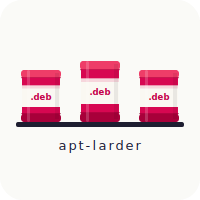

<p align="center">
  
</p>

# apt-larder

> stock your packages, serve them fresh.

[](https://github.com/jbox-web/apt-larder/blob/master/LICENSE)
[](https://github.com/jbox-web/apt-larder/actions/workflows/ci.yml)
[](https://github.com/jbox-web/apt-larder/releases/latest)

## Table of contents

- [How it works](#how-it-works)
- [Caching behaviour](#caching-behaviour)
- [Running with Docker](#running-with-docker)
- [Configuration](#configuration)
- [Environment variables](#environment-variables)
- [Admin UI & REST API](#admin-ui--rest-api)
- [System integration (`extra/`)](#system-integration-extra)
- [systemd integration](#systemd-integration)
- [Signals](#signals)
- [Development](#development)
- [Architecture](#architecture)
- [Alternatives](#alternatives)
- [Compared to apt-cacher-ng](#compared-to-apt-cacher-ng)
- [TODO](#todo)
- [License](#license)

---

An HTTP caching proxy for APT package repositories. It sits between `apt` clients and upstream Debian/Ubuntu mirrors, caching `.deb` packages indefinitely and index files (`Release`, `Packages`, …) for a configurable TTL.

Designed for homelabs and CI pipelines where multiple machines repeatedly install the same packages.

## How it works

apt-larder supports two operating modes:

**Transparent proxy mode** — configure APT to use apt-larder as an HTTP proxy. APT sends absolute URLs directly to the proxy.

```
# /etc/apt/apt.conf.d/01proxy
Acquire::http::Proxy "http://apt-larder-host:3142";
```

**Host-in-path mode** — rewrite `sources.list` entries to route through apt-larder by embedding the upstream host in the path.

```
# Before
deb http://deb.debian.org/debian trixie main

# After
deb http://apt-larder-host:3142/deb.debian.org/debian trixie main
```

Both modes can coexist.

## Caching behaviour

| File type | Cached |
|-----------|--------|
| `.deb`, `.udeb`, `.ddeb` | Forever (immutable) |
| Paths containing `/pool/` or `/by-hash/` | Forever (immutable) |
| `Release`, `Packages`, `InRelease`, … | Until `index_ttl` minutes have elapsed |

Immutable files are SHA256-verified on first serve per session. Corrupt files are invalidated and re-downloaded automatically. Incomplete downloads (Content-Length mismatch) are never cached.

Concurrent requests for the same file are deduplicated: one upstream fetch serves all waiting clients.

`Range` requests (`bytes=start-end`) are supported: apt-larder seeks to the requested offset and returns `206 Partial Content`. This allows clients to resume interrupted downloads without re-fetching the full file.

## Running with Docker

A `docker-compose.yml` is included for quick local testing:

```sh
docker compose up -d apt-larder
# clients are pre-configured to use the proxy
docker compose run client1 apt-get install -y redis-server
```

The admin UI is available at `http://localhost:8080` once the container is up.

For production, build a static binary image:

```sh
mise release:static    # builds linux/amd64 and linux/arm64 via docker buildx bake
```

The resulting image is distroless. Mount a config file, a cache volume, and a logs volume:

```sh
docker run -d \
  -p 3142:3142 \
  -p 8080:8080 \
  -v /srv/apt-larder.yml:/home/nonroot/apt-larder.yml:ro \
  -v /srv/apt-cache:/home/nonroot/cache \
  -v /srv/apt-logs:/home/nonroot/logs \
  apt-larder:latest server --config /home/nonroot/apt-larder.yml
```

## Configuration

Default config file: `apt-larder.yml` (override with `--config` / `-c`).

```yaml
cache_dir: ./cache          # where packages are stored on disk
index_ttl: 5                # minutes before index files are revalidated
max_redirects: 5            # max HTTP redirects to follow per request
connect_timeout: 10         # upstream connect timeout, seconds
read_timeout: 30            # upstream read timeout, seconds
log_file: stdout            # "stdout" or a file path
log_level: info             # trace, debug, info, warn, error, fatal, off
quiet: false                # when true, only MISS and ERR are logged (application-level filter)
evict_after_days: 0         # delete files not accessed for N days (0 = disabled)
max_cache_size_gb: 0        # max cache size in GB — evicts LRU when exceeded (0 = disabled)
server_host: "0.0.0.0"
server_port: 3142

# remaps:                   # optional host remapping
#   deb.debian.org: my-mirror.internal

admin:
  enabled: false
  host: "127.0.0.1"         # bind address — change to 0.0.0.0 if behind a reverse proxy
  port: 8080
  api_token: ""             # Bearer token for /api/* — empty = no auth
  ui_user: ""               # HTTP Basic user for the web UI — empty = no auth
  ui_password: ""

# Optional host remapping. Redirects requests for a given upstream host to a
# different mirror. The cache key always uses the original hostname.
# Value can be a bare hostname, host:port, or a full URL.
# remaps:
#   deb.debian.org: my-mirror.internal
#   archive.ubuntu.com: "http://ubuntu-mirror.lan:80"
```

## Environment variables

Any config field can be overridden with an environment variable — useful for Docker secrets and CI pipelines. Env vars take precedence over the config file.

Convention: `APT_LARDER_<FIELD>` (uppercase, underscores). Nested admin fields use `APT_LARDER_ADMIN_<FIELD>`.

| Variable | Config field |
|----------|-------------|
| `APT_LARDER_CACHE_DIR` | `cache_dir` |
| `APT_LARDER_INDEX_TTL` | `index_ttl` |
| `APT_LARDER_MAX_REDIRECTS` | `max_redirects` |
| `APT_LARDER_CONNECT_TIMEOUT` | `connect_timeout` |
| `APT_LARDER_READ_TIMEOUT` | `read_timeout` |
| `APT_LARDER_LOG_FILE` | `log_file` |
| `APT_LARDER_LOG_LEVEL` | `log_level` |
| `APT_LARDER_QUIET` | `quiet` |
| `APT_LARDER_EVICT_AFTER_DAYS` | `evict_after_days` |
| `APT_LARDER_MAX_CACHE_SIZE_GB` | `max_cache_size_gb` |
| `APT_LARDER_SERVER_HOST` | `server_host` |
| `APT_LARDER_SERVER_PORT` | `server_port` |
| `APT_LARDER_ADMIN_ENABLED` | `admin.enabled` |
| `APT_LARDER_ADMIN_HOST` | `admin.host` |
| `APT_LARDER_ADMIN_PORT` | `admin.port` |
| `APT_LARDER_ADMIN_API_TOKEN` | `admin.api_token` |
| `APT_LARDER_ADMIN_UI_USER` | `admin.ui_user` |
| `APT_LARDER_ADMIN_UI_PASSWORD` | `admin.ui_password` |

Boolean fields accept `true`, `1`, `yes` (case-insensitive) as truthy.

Docker Compose example:
```yaml
services:
  apt-larder:
    environment:
      APT_LARDER_ADMIN_API_TOKEN: "${API_TOKEN}"
      APT_LARDER_ADMIN_UI_PASSWORD: "${UI_PASSWORD}"
```

## Admin UI & REST API

When `admin.enabled: true`, a second server starts on `admin.port` with:

- **Web UI** at `/` — dashboard (hit rate, bytes served, …), cache browser with search/sort/pagination (DataTables), and an eviction form.
- **REST API** at `/api/*` — programmatic cache management.

### API endpoints

| Method | Path | Description |
|--------|------|-------------|
| `GET` | `/api/health` | `{"status":"ok","version":"..."}` |
| `GET` | `/api/stats` | Cumulative counters: hits, misses, revalidations, errors, bytes |
| `GET` | `/api/metrics` | Prometheus text format (counters + cache_entries gauge) |
| `GET` | `/api/cache` | Paginated entry list (`?prefix=&page=&per_page=`) |
| `DELETE` | `/api/cache` | Flush the entire cache |
| `DELETE` | `/api/cache/:key` | Invalidate one entry (key URL-encoded) |
| `POST` | `/api/evict` | Run eviction now — body: `{"max_age_days":N}` (defaults to `evict_after_days` config value) |

All responses are `application/json`. Errors return `{"error":"..."}`.

### Prometheus metrics

`GET /api/metrics` returns Prometheus text format 0.0.4:

```
# HELP apt_larder_hits_total Total cache hits served to clients.
# TYPE apt_larder_hits_total counter
apt_larder_hits_total 1234
# HELP apt_larder_misses_total Total upstream fetches triggered.
# TYPE apt_larder_misses_total counter
apt_larder_misses_total 56
# HELP apt_larder_revalidations_total Total 304 Not Modified revalidations.
# TYPE apt_larder_revalidations_total counter
apt_larder_revalidations_total 12
# HELP apt_larder_errors_total Total requests that resulted in an error.
# TYPE apt_larder_errors_total counter
apt_larder_errors_total 3
# HELP apt_larder_bytes_served_total Total bytes written to clients from cache.
# TYPE apt_larder_bytes_served_total counter
apt_larder_bytes_served_total 4398046511
# HELP apt_larder_cache_entries Current number of files tracked in the cache.
# TYPE apt_larder_cache_entries gauge
apt_larder_cache_entries 847
```

Prometheus scrape config:

```yaml
scrape_configs:
  - job_name: apt-larder
    static_configs:
      - targets: ["apt-larder-host:8080"]
    metrics_path: /api/metrics
    bearer_token: "your-api-token"   # omit if api_token is empty
```

### Authentication

Two independent mechanisms — leave both empty to disable auth:

- **API** (`/api/*`): `Authorization: Bearer <api_token>`
- **UI** (`/*`): HTTP Basic Auth (`ui_user` / `ui_password`)

## System integration (`extra/`)

The `extra/` directory contains ready-to-use files for running apt-larder as a managed system service:

| File | Description |
|------|-------------|
| `apt-larder.service` | systemd unit (`Type=notify`, watchdog, hardening) |
| `apt-larder.yml.example` | Production config with system paths |
| `apt-larder.logrotate` | logrotate config — sends `SIGUSR1` after rotation |
| `grafana-dashboard.json` | Grafana dashboard for the Prometheus metrics |

See [`extra/README.md`](extra/README.md) for installation instructions.

## systemd integration

When managed by systemd with `Type=notify`, apt-larder:
- Sends `READY=1` once bound and listening — systemd won't mark the service as started until then.
- Sends `STOPPING=1` on `SIGTERM` before draining in-flight requests.
- Resets the watchdog timer (`WATCHDOG=1`) at half the configured `WatchdogSec` interval.
- Updates `STATUS=` with hourly stats (visible in `systemctl status apt-larder`).

A ready-to-use unit file is provided in [`extra/apt-larder.service`](extra/README.md).

## Signals

| Signal | Effect |
|--------|--------|
| `SIGTERM` | Graceful shutdown — stops accepting new connections, waits for in-flight requests to finish |
| `SIGUSR1` | Reopen the log file (for log rotation with tools like `logrotate`) |

## Development

Prerequisites: [mise](https://mise.jdx.dev/). The toolchain is pinned to
Crystal **1.18.2** in `mise.toml` — always drive the compiler through `mise` so
this exact version is used. A newer `crystal` on your `PATH` may compile code
that relies on post-1.18 APIs and then break the CI/Docker build.

```sh
mise dev:deps      # install shards
mise dev:check     # build + lint + test in one shot
mise dev:build     # compile dev binary → bin/apt-larder
mise dev:spec      # run tests
mise dev:ameba     # lint
mise dev:format    # format source
```

Run a single spec file (extra args are forwarded to the task):

```sh
mise dev:spec spec/proxy_spec.cr
```

## Architecture

```
src/apt-larder.cr          Entry point: config, signals, server loop
src/apt_larder/
  cli.cr                   Admiral CLI — subcommands: server, info
  config.cr                YAML config
  admin_config.cr          Nested admin config (port, auth)
  proxy.cr                 HTTP handler: resolve → ensure_cached → serve
  cache.cr                 Filesystem cache — atomic writes, TTL, SHA256 sidecars, LRU eviction
  single_flight.cr         Concurrent deduplication — one upstream fetch per key
  connection_pool.cr       Per-host HTTP connection pool with stale-connection retry
  server.cr                HTTP server lifecycle (start/stop, graceful shutdown, background loops)
  systemd.cr               systemd sd_notify integration (READY=1, STOPPING=1, watchdog, STATUS=)
  admin/
    server.cr              Admin server: routing + per-prefix auth middleware
    api.cr                 JSON REST API handlers (/api/*)
    handler.cr             Serves embedded HTML/CSS/JS assets (/*)
src/assets/admin/
  index.html / app.js / style.css   Web UI compiled into the binary at build time
```

Request flow: `Proxy#handle` → `resolve` → `ensure_cached` → `SingleFlight#run` → `download` (conditional GET with `If-Modified-Since`) → `serve`.

## Alternatives

| Project | Language | Notes |
|---------|----------|-------|
| [apt-cacher-ng](https://www.unix-ag.uni-kl.de/~bloch/acng/) | C++ | The reference implementation. More configurable, requires more setup. |
| [soulteary/apt-proxy](https://github.com/soulteary/apt-proxy) | Go | Also caches YUM and APK, very small binary (~2 MB). |
| [lox/apt-proxy](https://github.com/lox/apt-proxy) | Go | Simple APT-only proxy, minimal feature set. |
| [apt-cacher-rs](https://github.com/cgzones/apt-cacher-rs) | Rust | apt-cacher-ng rewrite in Rust, includes a minimal web UI. |
| Squid | C | General-purpose HTTP proxy; can cache APT with the right config but not purpose-built. |

## Compared to apt-cacher-ng

apt-cacher-ng is the reference APT proxy. The two tools cover largely the same ground — caching, deduplication, integrity checking, CONNECT tunneling — and apt-cacher-ng is more mature and more configurable. apt-larder trades configuration flexibility for operational simplicity.

### Where apt-larder is genuinely simpler

**Single static binary, no runtime dependencies.**
The release build is a fully-static Linux binary. The Docker image is distroless. apt-cacher-ng requires a C++ runtime, several shared libraries, and typically runs under systemd. apt-larder is a single file you drop and run.

**Zero required configuration.**
apt-larder works out of the box with sensible defaults. apt-cacher-ng requires at minimum a `CacheDir` and `Port` in its config, and correct `Remap-*` entries for each distribution you want to cache. apt-larder infers immutability from URL structure and needs no per-distribution setup.

**Intentionally fixed immutability rules.**
apt-cacher-ng exposes `VfilePatternEx` and `PfilePatternEx` for fine-grained control over which URLs are volatile or permanent. apt-larder uses a hardcoded heuristic (`.deb`/`.udeb`/`.ddeb`, `/pool/`, `/by-hash/`) that covers all standard Debian and Ubuntu repositories without configuration.

### What apt-larder does not have

- **Import from local archives.** apt-cacher-ng can seed its cache from an existing local Debian mirror. apt-larder populates its cache on demand only.
- **acngfs.** apt-cacher-ng includes a FUSE filesystem that exposes the cache as a virtual Debian archive. apt-larder has no equivalent.
- **Fine-grained URL pattern control.** If you need custom rules for non-standard repository layouts, apt-cacher-ng's pattern system is more flexible.

### When to choose apt-cacher-ng instead

- You need fine-grained URL pattern control for non-standard repositories.
- You need to seed the cache from an existing local mirror.
- You are already running apt-cacher-ng and it is working.

## TODO

- **sendfile(2) zero-copy serving** — the current implementation uses a 64 KB buffered copy loop. `Socket#sendfile` was merged into Crystal master in [PR #16665](https://github.com/crystal-lang/crystal/pull/16665) (milestone 1.21.0). Once Crystal 1.21 ships, `serve` can be updated to use it, eliminating the userspace copy on the hot HIT path.

## License

MIT
